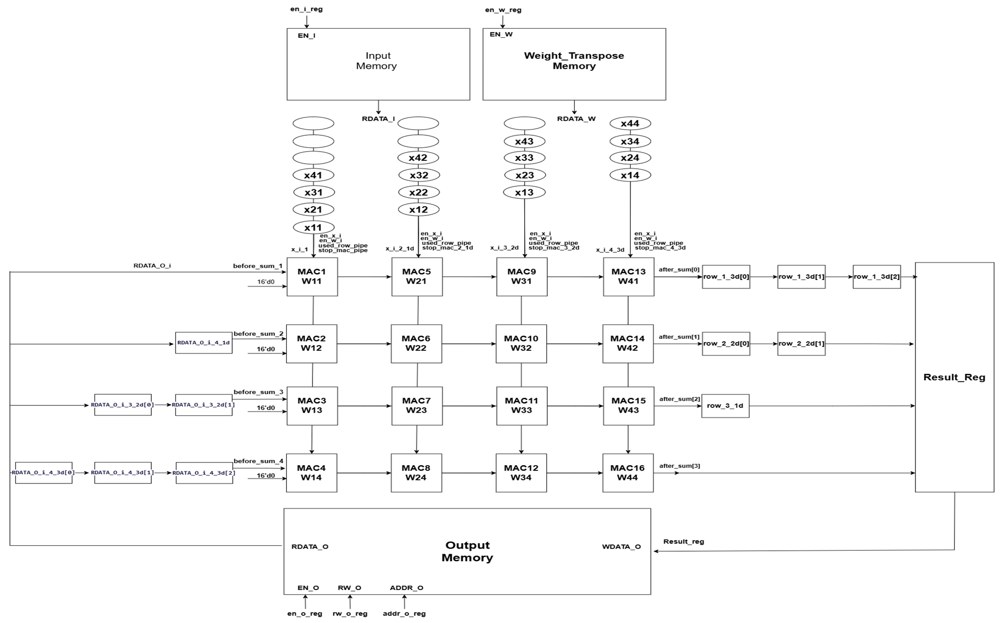
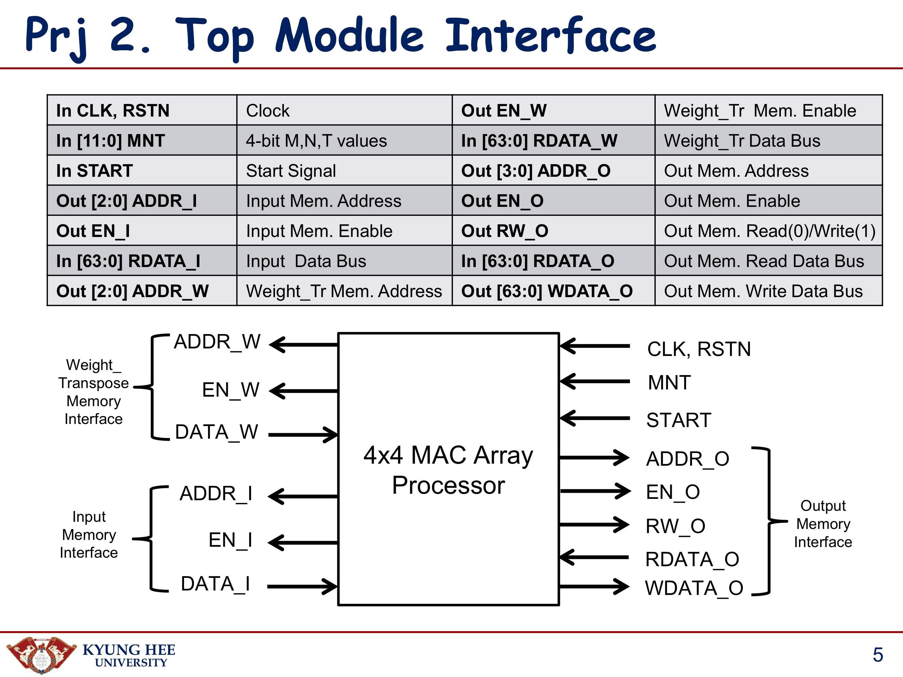

# 4x4 Weight Stationary Systolic Array

---

## 🇰🇷 프로젝트 개요 (Project Overview)

**Kyung Hee University EE361 (Digital Circuit Design)** 과목의 기말 프로젝트로 설계한 **Systolic Array 기반 행렬 곱셈 가속기**입니다.

최근 AI 가속기(NPU/TPU)의 핵심 구조인 **Systolic Array** 아키텍처를 Verilog로 구현했습니다.**4x4 Processing Element (PE) Array**를 사용하여, 제어 로직(FSM)을 통해 최대 **8x8 크기의 가변 행렬 곱셈** ([TxN] x [NxM])을 수행할 수 있도록 설계되었습니다. 하드웨어 자원의 효율성을 극대화하기 위해 **Matrix Folding (행렬 접기)** 기법을 적용하였으며, Python과 연동된 자동화 검증 환경을 구축하여 신뢰성을 확보했습니다.

### 📋 Technical Specifications
| Feature | Description |
| :--- | :--- |
| **Core Architecture** | Weight Stationary Systolic Array |
| **Array Size** | Physical **4×4** PE Array |
| **Precision** | Input/Weight: **INT8** (Signed), Accumulation: **INT16** |
| **Matrix Support** | Variable sizes (M, N, T ∈ [1, 8]) via **Matrix Folding** |
| **Control Logic** | One-Shot Handshake FSM |
| **Verification** | Python-Verilog Co-simulation (Self-Checking) |

---

## 🏗️ 시스템 아키텍처 (System Architecture)





### 1. Hardware Hierarchy
전체 하드웨어는 모듈성을 강조한 계층적 구조로 설계되었습니다.

* **`MAC_TOP` (Controller):** 최상위 모듈로, FSM을 포함하며 외부 메모리(SRAM)와의 인터페이스 및 전체 데이터 패스 제어를 담당합니다.



* **`MAC_4X4_ARRAY` (Core):** 4개의 Column 모듈로 구성된 연산 어레이입니다. Systolic 동작을 위한 **Input Skewing (입력 지연)** 및 **Output De-skewing (출력 정렬)** 로직이 포함되어 있습니다.
* **`MAC_4X1_COL` (Column):** 4개의 PE가 수직으로 연결된 구조입니다. 입력 데이터(i)와 가중치(w)가 위에서 아래로 전파됩니다.
* **`MAC_1X1_UNIT` (PE):** 8-bit 곱셈과 16-bit 덧셈(MAC)을 수행하는 최소 연산 단위입니다.

### 2. Dataflow: Weight Stationary (WS)
본 설계는 **Weight Stationary (가중치 고정)** 방식을 채택하여 메모리 접근 비용을 최소화하고 데이터 재사용성을 높였습니다.

* **동작 원리:**
    1.  **Weight Loading:** 연산 시작 전, `LOAD_W` 상태에서 가중치(W)를 각 PE의 내부 레지스터에 미리 로드하고 고정(Stationary)합니다.
    2.  **Input Streaming:** 입력 데이터(Input)는 매 클럭마다 **Input Skewing**을 통해 대각선 형태(Wavefront)로 좌측에서 우측으로 흐릅니다.
    3.  **Partial Sum Accumulation:** 각 PE는 고정된 가중치와 들어오는 입력을 곱한 뒤, 위쪽 PE에서 내려온 부분합(Partial Sum)과 더하여 아래쪽 PE로 전달합니다.
* **장점:** 가중치를 한 번 로드한 후 입력 데이터를 스트리밍하는 동안 계속 재사용하므로, 가중치 메모리(SRAM) 접근 횟수를 획기적으로 줄여 전력 효율을 높입니다.

### 3. Finite State Machine (FSM)
안정적인 제어를 위해 **One-Shot Handshake** 방식을 채택했습니다.

* **`IDLE`**: `START` 신호 대기 및 내부 카운터 리셋.
* **`READY`**: 연산 시작 전 주소 및 카운터 초기화 (Setup).
* **`LOAD_W`**: SRAM에서 가중치를 읽어와 PE Array에 로드.
* **`LOAD_I` & `STORE_O`**: 입력 데이터를 주입하고 연산 결과를 출력. 행렬 크기가 4x4를 초과할 경우, FSM이 이를 감지하여 **Folding (반복 연산)** 을 수행.
* **`STOP`**: 모든 연산 완료 시 1-cycle `DONE` 펄스를 출력하고 `IDLE`로 복귀.

---

## 💡 핵심 설계 특징 (Key Design Features)

### 1. 효율적인 PE (Processing Element) 설계: Operand Masking
단순히 데이터를 흘려보내는 것이 아니라, 유효하지 않은 연산이 누적(Accumulate)되는 것을 방지하기 위해 PE 레벨에서 **Input Gating** 및 **Reset** 로직을 구현했습니다.

* **설계 의도:** 행렬의 크기가 Array보다 작거나 유효하지 않은 행(`used_row` is low)일 경우, 이전 연산 결과가 오염되는 것을 막고 불필요한 스위칭을 방지합니다.
* **구현 로직:**
    * `used_row` 신호를 웨이트와 함께 파이프라인으로 전파하여, 해당 PE가 현재 연산에 참여해야 하는지 판단합니다.
    * `en_w_i` (웨이트 로드 중), `stop_mac_reg` (연산 중단), `~used_row_reg` (미사용 행) 조건에서는 `SUM`을 `0`으로 강제하여 결과의 무결성을 보장합니다.

### 2. Matrix Folding (Tiling) 제어
고정된 4x4 하드웨어로 최대 8x8 행렬을 처리하기 위해, 입력 행렬의 크기(M, N, T)에 따라 연산을 8가지 시나리오로 나누어 처리하는 **FSM 제어 로직**을 구현했습니다.

* **설계 의도:** 사용자가 입력하는 M, N, T (1~8)의 모든 조합에 대해 하드웨어 재설계 없이 유연하게 대응합니다.
* **구현 로직 (`MAC_TOP.v`):**
    * M, N, T가 4보다 큰지 작은지를 판별하여 3-bit `stage` 신호를 생성합니다.
    * **8가지 Tiling 시나리오:**
        * `Stage 0 (000)`: 4x4 이하 (1회 연산 종료)
        * `Stage 1~6`: M, N, T 중 하나 또는 두 개가 4를 초과 (2~4회 분할 연산)
        * `Stage 7 (111)`: 8x8 완전 행렬 (총 8회 이상의 복합 분할 연산 수행)
    * 각 시나리오에 맞춰 `LOAD_W` → `LOAD_I` → `STORE_O` 상태를 오가며 필요한 횟수만큼 Loop를 수행하고 결과를 메모리에 누적합니다.

---

## 🧪 검증 전략 (Verification Strategy)

단순 파형 확인을 넘어, 현업 수준의 신뢰성을 확보하기 위해 **자동화된 Self-Checking 환경**을 구축했습니다.

### 1. Python Golden Model Generator (`golden_gen.py`)
* `NumPy`를 사용하여 무작위 또는 지정된 패턴의 입력에 대한 정답(Golden Vector)을 생성합니다.
* 하드웨어 메모리 구조(64-bit packed)에 맞춰 `.hex` 파일을 자동 생성합니다.
* **X-Pessimism 적용:** 사용하지 않는 메모리 영역은 `0`이 아닌 `x` (Unknown)로 마킹하여, 하드웨어가 잘못된 주소에 데이터를 쓰는 오류(Memory Corruption)를 엄격하게 검출합니다.

### 2. Automated Testbench (`TB_MAC_TOP.v`)
* **Auto-Traversal:** 8가지의 다양한 Matrix Folding 시나리오와 경계값(Min/Max) 케이스를 자동으로 순회합니다.
* **Handshake Protocol:** DUT의 `DONE` 신호를 감지하여 다음 케이스로 진행합니다.
* **Between-Case Reset:** 각 테스트 케이스 시작 전, 출력 메모리를 `x`로 강제 초기화하여 **이전 케이스의 잔여 데이터(Garbage Data)** 로 인한 False Pass를 원천 차단했습니다.

---

## 🚀 실행 방법 (How to Run)

전제 조건: iverilog (Icarus Verilog) 및 python3 (numpy 설치 필요).

```bash

# 1. 시뮬레이션 디렉토리로 이동
cd sim

# 2. Python으로 정답 벡터 및 16진수 파일 생성 & Verilog 시뮬레이션 실행 (결과 자동 확인)
source run.sh
```

---

## 📊 시뮬레이션 결과 (Simulation Results)

### 1. Waveform Analysis
`ModelSim`과 `GTKWave`를 통해 확인한 결과, 8x8 케이스(Stage 7)에서 FSM이 `LOAD_W`와 `LOAD_I`를 반복하며 큰 행렬을 작은 블록으로 나누어 처리하는(Folding) 동작이 정확히 수행됨을 확인했습니다.

### 2. Verification Log (Self-Checking)
Python Golden Model과 Verilog DUT의 출력 결과를 비트 단위로 비교한 결과, MNT 8가지 타일링 시나리오에 대한 각각의 케이스 모두 **Pass** 하였습니다.
(MNT 111 ~ 888, 512가지 모든 경우를 테스트해볼 수도 있음.)

```bash
------------------------------------
[INFO] Test Sequence Started.
------------------------------------
[RUNNING] Case 0 (MNT = 444) ... [PASSED] Case 0
[RUNNING] Case 1 (MNT = 337) ... [PASSED] Case 1
[RUNNING] Case 2 (MNT = 374) ... [PASSED] Case 2
[RUNNING] Case 3 (MNT = 376) ... [PASSED] Case 3
[RUNNING] Case 4 (MNT = 634) ... [PASSED] Case 4
[RUNNING] Case 5 (MNT = 738) ... [PASSED] Case 5
[RUNNING] Case 6 (MNT = 583) ... [PASSED] Case 6
[RUNNING] Case 7 (MNT = 656) ... [PASSED] Case 7
------------------------------------
[SUCCESS] All 8 test cases passed!
------------------------------------
```

특히 X-Pessimism 전략을 통해, 이전 케이스의 연산 결과(Garbage Data)가 다음 케이스의 결과에 영향을 미치지 않음을 엄격하게 검증했습니다.

---

## 📂 디렉토리 구조 (Directory Structure)

```bash
ws-systolic-array
├── doc/
│   └── WS_MAC_ARRAY_PPT.pdf    # 프로젝트 발표 PPT
│   └── WS_MAC_ARRAY_REPORT.pdf # 프로젝트 결과 보고서
├── sim/
│   ├── matrix-hex/             # Hex 파일 및 생성 스크립트
│   │   ├── golden_gen.py       # Python Golden Model 생성기
│   │   └── *.hex               # 생성된 Input/Weight_T/Golden hex 파일
│   ├── TB_MAC_TOP.v            # 자동화된 테스트벤치
│   └── run.sh                  # 시뮬레이션 실행 스크립트
├── src/
│   ├── MAC_TOP.v               # Top 모듈 (FSM + Datapath)
│   ├── MAC_4X4_ARRAY.v         # Systolic Array Core
│   ├── MAC_4X1_COL.v           # Column 모듈
│   ├── MAC_1X1_UNIT.v          # PE (Processing Element)
│   └── SRAM.v                  # 메모리 모델
└── README.md
```

---

## 📚 References

* **Telesens:** [Matrix Multiplication on a Weight Stationary 2D Systolic Array (MXU on a Google TPU)](https://www.telesens.co/2018/07/30/systolic-architectures/#Matrix_Multiplication_on_a_Weight_Stationary_2D_Systolic_Array_MXU_on_a_Google_TPU)